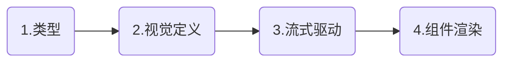

# 前端开发指南 (Frontend Development Guide)

**核心使命**: 融合 **未来主义 (Futurism)** 美学与 **极简主义 (Minimalism)** 架构，打造超越 Vercel AI SDK 的沉浸式 AI 交互体验。不仅仅是构建界面，更是雕刻 **流动的数字艺术品**。

## 🎨 1. 设计哲学 (Design Philosophy)

我们的 UI 语言建立在 "有机科技 (Organic Tech)" 的基础之上。界面应当像水一样流动（Liquid），像空气一样轻盈（Glass），像生物一样呼吸（Micro-interactions）。

### 五大美学支柱

1. **极简主义 (Minimalism - The Foundation)**
* **原则**: "少即是多"。内容是主角，UI 只是光影。
* **实现**: 严控色板（Palette），主要使用 `Zinc`/`Slate` 等低饱和度色系。留白（Whitespace）不是空洞，而是为了呼吸感。


2. **流体美学 (Liquid/Fluid Design - The Motion)**
* **原则**: 拒绝生硬的跳变。布局的改变、对话气泡的生长、侧边栏的展开，必须如水流般顺滑自然。
* **实现**: 使用 `Framer Motion` 或 `AutoAnimate` 处理 DOM 布局变更。AI 输出文字时，容器应当平滑撑开，而非卡顿跳动。


3. **毛玻璃/磨砂玻璃 (Glassmorphism - The Depth)**
* **原则**: 建立纵深感 (Z-Axis)。
* **实现**: 在浮动层（Dialog, Toast, Floating Menu, Sticky Header）使用细腻的背景模糊。
* **参数**: 推荐 `backdrop-blur-md` 配合 `bg-white/80` (Light) 或 `bg-black/40` (Dark)。避免过度使用导致性能下降，仅用于**层级分离**。


4. **微交互图标 (Micro-interaction Icons - The Soul)**
* **原则**: 图标不是静止的像素，它们是对用户行为的响应。
* **实现**: Hover 时图标的轻微旋转、点击时的缩放反馈（Scale Down）、状态切换时的路径变形（Morphing）。


5. **未来主义 (Futurism - The Vibe)**
* **原则**: 精准、理性、高亮。
* **实现**: 强调数据可视化，使用等宽字体（JetBrains Mono）展示关键参数。在 Focus 状态或 AI 思考时，使用细微的 "光效" 或 "呼吸灯" 效果。


### UI 技术选型 (Mandatory)

| 模块 | 选型 | 设计意图 |
| --- | --- | --- |
| **组件系统** | **shadcn-vue** | 极简主义的骨架，极致可控的 Headless 基础。 |
| **样式引擎** | **Tailwind CSS** | 原子化构建。 |
| **动效/流体** | **VueUse (useTransition)** / **AutoAnimate** | 负责 **Fluid Design**。列表重排、DOM 增删必须有过渡。 |
| **质感渲染** | **CSS Backdrop Filters** | 负责 **Glassmorphism**。严禁使用不透明的纯色遮罩层。 |
| **图标交互** | **Lucide Vue** + **CSS/SVG Animation** | 负责 **Micro-interactions**。图标需配合 Hover/Active 态动效。 |
| **字体系统** | **Inter (UI)** / **JetBrains Mono (Code/Data)** | **Futurism** 的核心体现。代码块与 AI 数据需用等宽字体。 |

---

## 💎 2. UX 交互细节 (UX Refinements)

### 沉浸式 AI 体验

* **输入框 (The Portal)**: 输入框不仅仅是 Input，它是连接人类与 AI 的 "传送门"。
* *Idle*: 极简线条，透明背景。
* *Focus*: **Glassmorphism** 背景浮现，细微的光晕（Glow）边框，暗示 AI 已准备就绪。


* **消息流 (The Stream)**:
* AI 生成的内容应像打印机一样流出，但要带有 **Fluid** 的平滑感，避免文字闪烁。
* 代码块渲染时，应带有轻微的淡入（Fade-in）和上浮（Slide-up）效果。


### 视觉层级与反馈

* **Button Micro-interactions**:
* 点击任何按钮，必须有 `active:scale-95` 的触感反馈。
* 复制按钮（Copy Button）点击后，图标应 Morph 变为 "对号"，维持 2s 后变回。


* **Loading States**:
* 拒绝枯燥的旋转圆圈。使用 **Futurism** 风格的脉冲条（Pulse Bar）或 **Fluid** 风格的波浪动效。


---

## 🏗️ 3. Agent 架构与视觉绑定 (Visual Architecture)

每个 Agent 不仅逻辑独立，**视觉 ID** 也需独立，以增强沉浸感。



#### 视觉定义 `src/styles/agents/theme-matrix.css`

在此处定义未来主义色板：

```css
/* Agent: Coder (Cyberpunk/Matrix Vibe) */
.theme-coder {
  --agent-glow: 0 0 20px rgba(0, 255, 128, 0.2); /* 光晕 */
  --agent-glass: rgba(0, 20, 10, 0.7); /* 磨砂基底 */
}

/* Agent: Writer (Paper/Fluid Vibe) */
.theme-writer {
  --agent-glow: 0 0 15px rgba(255, 200, 100, 0.1);
  --agent-glass: rgba(255, 255, 255, 0.8);
}

```

---

## 🔄 4. SSE 状态与视觉映射 (Visual State Mapping)

后端状态必须精确映射到前端的视觉隐喻：

| SSE 事件 | UI 表现 (Visual Metaphor) | 动效要求 |
| --- | --- | --- |
| `THINKING` | **Glassmorphism** 面板展开，内部文字模糊闪烁 | 呼吸效果 (Breathing)，模拟神经元活动 |
| `TOOL` | 卡片式 UI，像积木一样嵌入对话流 | 插入时要有弹簧动画 (Spring Animation) |
| `DONE` | 光标消失，边框高亮消退 | 平滑过渡，无突变 |

---

## 🏗️ 5. 系统架构：基于领域驱动的分层解耦 (Layered Architecture)

一个"优秀"的前端架构不只是把代码跑通，而是要解决**"规模化后的混乱"**。我们采用基于**领域驱动设计（DDD）**的五层架构，遵循**"职责分离（SoC）"**和**"单向数据流"**的核心原则。

### 5.1 核心系统架构图

```
┌─────────────────────────────────────────────────────────────┐
│                      View 层 (Components)                    │
│  职责：纯粹的 UI 渲染，只负责触发事件和展示数据               │
│  禁止：直接调用 API、直接修改 Store 状态                      │
└─────────────────────────────────────────────────────────────┘
                              ↓
┌─────────────────────────────────────────────────────────────┐
│              Composables 层 (业务逻辑操盘手)                 │
│  职责：连接 UI 和底层数据，处理组件级业务逻辑                 │
│  例如：useSSE、useMessageAggregator、useChatInput            │
└─────────────────────────────────────────────────────────────┘
                              ↓
┌─────────────────────────────────────────────────────────────┐
│                  Store 层 (Pinia)                            │
│  职责：跨组件共享的全局状态，封装数据获取策略                 │
│  核心：谁的数据谁负责，Store 自己决定何时从后端加载           │
└─────────────────────────────────────────────────────────────┘
                              ↓
┌─────────────────────────────────────────────────────────────┐
│              Services/Domain 层 (核心业务逻辑)               │
│  职责：数据转换、业务规则、格式化（Data Mapping）             │
│  例如：DTO 转 Model、驼峰/下划线转换、数据校验                │
└─────────────────────────────────────────────────────────────┘
                              ↓
┌─────────────────────────────────────────────────────────────┐
│            Infrastructure 层 (API/Axios)                     │
│  职责：HTTP 通信、请求拦截、错误处理、第三方库封装            │
└─────────────────────────────────────────────────────────────┘
```

### 5.2 数据流转逻辑：完整的生命周期

以"发送消息"为例，看数据如何在系统内流转：

```
1. View 层 (UserMessage.vue)
   ↓ 用户点击发送按钮
   ↓ 调用 Composable 方法
   
2. Composable 层 (useChatInput.ts)
   ↓ 校验输入、组装数据
   ↓ 调用 Store Action
   
3. Store 层 (chatStore.ts)
   ↓ 乐观更新：先更新本地状态
   ↓ 调用 Service 层发送
   
4. Service 层 (chatService.ts)
   ↓ 数据转换（前端 Model → 后端 DTO）
   ↓ 调用 API 层
   
5. API 层 (api/chat.ts)
   ↓ Axios 发送请求
   ↓ 响应拦截处理
   
6. 数据回流
   ↓ Service 转换响应数据
   ↓ Store 更新状态
   ↓ Vue 响应式自动更新 View
```

### 5.3 职责分离红线（严禁）

| 层级 | 允许 | 禁止 |
|------|------|------|
| **View** | 读取 props/computed、触发事件 | 直接 `axios.get`、直接修改 `store.xxx = yyy` |
| **Composable** | 组件级逻辑、调用 Store | 直接操作 DOM、直接调用 API |
| **Store** | 管理状态、封装加载策略 | 在 View 中直接调用 `loadXXX` |
| **Service** | 数据转换、业务逻辑 | 操作 UI、修改 Store |
| **API** | HTTP 通信、拦截器 | 业务逻辑、数据转换 |

### 5.4 "谁的数据谁负责"原则

**核心规则**：
- **messages 数据**：由 `chatStore` 完全拥有
  - Store 决定何时从后端加载（缓存策略、temp→real 判断）
  - View 只通过 `computed(() => store.messages)` 读取
  - View **严禁**调用 `store.loadMessages()`

- **activeSession**：由 `chatStore` 管理
  - 外部只能通过 `setActiveSessionId(id)` 通知 Store
  - Store 内部 `watch` 并自动处理加载逻辑

**示例对比**：

```typescript
// ❌ 错误：View 层直接命令加载
// UserChat.vue
watch(sessionId, () => {
  chatStore.loadSession(newId)  // 禁止！
})

// ✅ 正确：View 只通知 Store，Store 自己决定
// UserChat.vue
watch(sessionId, () => {
  chatStore.setActiveSessionId(newId)  // 通知即可
})

// chatStore.ts
watch(activeSessionId, (newId) => {
  // Store 自己判断是否需要加载
  if (isTempToRealConversion) return  // 跳过
  loadSession(newId)  // Store 内部决定
})
```

### 5.5 类型安全防火墙

每一层都必须有明确的类型转换：

```typescript
// api/chat.ts - 后端原始类型
interface ChatMessageDTO {
  message_id: string  // 下划线
  created_at: string
}

// services/chatService.ts - 转换层
function transformMessage(dto: ChatMessageDTO): ChatMessage {
  return {
    messageId: dto.message_id,  // 转驼峰
    createdAt: new Date(dto.created_at)
  }
}

// stores/chatStore.ts - 使用转换后的类型
const messages = ref<ChatMessage[]>([])

// components/MessageList.vue - 类型安全的使用
const messages = computed(() => store.messages)  // 有完整类型提示
```

### 5.6 完整实例：发送消息的数据流

```typescript
// 1. View 层 - UserChat.vue
// 职责：纯粹的 UI 渲染，只触发事件
<template>
  <ChatInput v-model="inputText" @send="handleSend" />
  <MessageList :messages="messages" />
</template>

<script setup lang="ts">
const { inputText, handleSend } = useChatInput()  // 调用 Composable
const messages = computed(() => chatStore.messages)  // 只读取，不加载
</script>

// 2. Composable 层 - useChatInput.ts
// 职责：连接 UI 和 Store，处理组件级逻辑
export function useChatInput() {
  const inputText = ref('')
  const chatStore = useChatStore()
  
  const handleSend = async () => {
    if (!inputText.value.trim()) return
    
    // 组装数据，调用 Store
    await chatStore.sendMessage({
      content: inputText.value,
      sessionId: chatStore.activeSessionId
    })
    
    inputText.value = ''
  }
  
  return { inputText, handleSend }
}

// 3. Store 层 - chatStore.ts
// 职责：管理状态，决定数据加载策略
export const useChatStore = defineStore('chat', () => {
  const messages = ref<ChatMessage[]>([])
  const activeSessionId = ref<string | null>(null)
  
  // Store 自己管理加载逻辑
  watch(activeSessionId, async (newId) => {
    if (!newId || newId.startsWith('temp-')) return
    await loadSession(newId)  // Store 内部决定何时加载
  })
  
  const sendMessage = async (payload: SendMessagePayload) => {
    // 乐观更新
    const tempMessage = createTempMessage(payload)
    messages.value.push(tempMessage)
    
    // 调用 Service 发送
    const response = await chatService.sendMessage(payload)
    
    // 替换临时消息
    const index = messages.value.findIndex(m => m.id === tempMessage.id)
    if (index !== -1) {
      messages.value[index] = response
    }
  }
  
  const setActiveSessionId = (id: string) => {
    activeSessionId.value = id  // 只通知，不直接加载
  }
  
  return { messages, activeSessionId, sendMessage, setActiveSessionId }
})

// 4. Service 层 - chatService.ts
// 职责：数据转换、业务逻辑
export const chatService = {
  async sendMessage(payload: SendMessagePayload): Promise<ChatMessage> {
    // 数据转换：前端 Model → 后端 DTO
    const dto = {
      session_id: payload.sessionId,
      content: payload.content,
      message_type: 'text'
    }
    
    // 调用 API 层
    const response = await chatApi.sendMessage(dto)
    
    // 数据转换：后端 DTO → 前端 Model
    return transformMessage(response)
  }
}

// 5. API 层 - api/chat.ts
// 职责：HTTP 通信、拦截器
export const chatApi = {
  async sendMessage(dto: SendMessageDTO): Promise<ChatMessageDTO> {
    const response = await axios.post('/api/chat/messages', dto)
    return response.data
  }
}
```

### 5.7 为什么这个架构"优秀"？

| 维度 | 传统"一把梭"写法 | 优秀架构写法 | 优势 |
|------|------------------|-------------|------|
| **代码复用** | 逻辑写在 .vue 文件里，换个页面要重写 | 逻辑在 Composables 里，任何组件都能引用 | 高内聚 |
| **测试难度** | 必须启动浏览器测试组件 | 可以脱离 UI 对 Services 进行单元测试 | 易测试 |
| **数据一致性** | 多个页面修改数据，互不同步 | 全局唯一的 Store 维护数据源 | 单向数据流 |
| **后端变动** | 后端改了字段名，要改 50 个 .vue 文件 | 只需改 Service 层的一个 Mapping 函数 | 低耦合 |

---

## 💻 6. 代码质量与性能 (Performance & Quality)

为了支撑高强度的动画与特效，必须严控性能：

* **开发流程/架构**: 如下所示：
```

├─chat
│  │  Index.vue
│  │  README.md
│  │  types.ts
│  │
│  ├─api
│  │      mock.ts
│  │
│  └─components
│          EmotionAnalysis.vue
│          EmotionCalendar.vue
│          GreetingCard.vue
│          SettingsPanel.vue

```

这是一个非常好的架构，当只有 或 基本只有该页面使用的元素、组件 就直接封装在 pages 的文件夹中，并且配有 解释文档，全链条逻辑，只要是复用性不大的逻辑 都不需要抽取，来保证高自由度
开发时 以 tailwind + shadcn-vue 定制 为先，ant-design-vue, sass 为备选方案
* **避免重排 (Reflow)**: 在流体布局中，尽量使用 `transform` 进行位移，避免直接改变 `width/height` (除非使用 AutoAnimate 容器)。
* **CSS 变量**: 全局使用 CSS Variable 管理颜色与模糊度，便于实现 "一键换肤" 的未来感主题切换。

---

## ❌ DON'T (设计与架构禁区)

### 视觉设计禁区

1. **廉价的特效 (Cheap Effects)**
* ❌ 禁止使用大面积、高饱和度的渐变背景（这是 2015 年的设计，不是未来主义）。
* ❌ 禁止使用默认的、生硬的 `box-shadow`。阴影应该是弥散的、柔和的。


2. **滥用毛玻璃 (Overused Glass)**
* ❌ 禁止在正文内容背景使用毛玻璃（影响可读性）。**Glassmorphism 仅用于导航和浮层。**


3. **僵硬的交互 (Static UX)**
* ❌ 禁止按钮无 Hover/Active 态。
* ❌ 禁止内容瞬间出现/消失（必须有 Duration > 150ms 的过渡）。

### 架构与代码禁区

1. **数据流破坏 (Broken Data Flow)**
* ❌ **在 View 层直接调用 `axios` 或 `store.loadXXX()`** —— 必须通过 Composable 中转。
* ❌ **View 层通过 `watch` 触发数据加载** —— 应通过 Store 的 setters 或 actions 触发。
* ❌ **直接修改 Store 状态** —— 必须通过 Store 的 actions/mutations。

2. **职责混淆 (Mixed Responsibilities)**
* ❌ **在 Composable 中直接操作 DOM** —— 这是 View 层的职责。
* ❌ **在 Service 中修改 Store** —— Service 应该返回数据，由调用方决定如何存储。
* ❌ **在 Store 中处理 API 协议细节** —— 这是 API 层的职责。

3. **类型安全破坏 (Type Safety Violations)**
* ❌ **前后端类型混用** —— 必须使用 Service 层进行 DTO↔Model 转换。
* ❌ **使用 `any` 绕过类型检查** —— 除非万不得已，且必须添加注释说明。


---

**总结**:
我们正在构建的不是工具，而是 **Next-Gen Interface**。每一个圆角、每一帧动画、每一抹模糊，都是为了让 AI 看起来不再冰冷，而是充满**流动的智慧**。